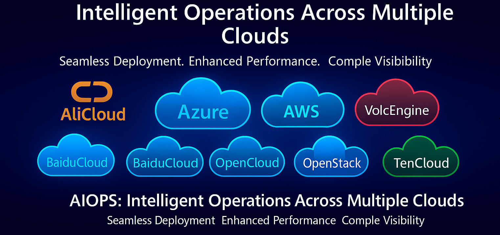

  

 

<h1> AIOPS: Next Generation Paradigm Of Multi cloud AI deployment and executable devops assistant
</h1>

[![Documentation][docs-image]][docs-url]
[![Discord][discord-image]][discord-url]
[![X][x-image]][x-url]
[![Reddit][reddit-image]][reddit-url]
[![Wechat][wechat-image]][wechat-url]
[![Wechat][oasis-image]][oasis-url]
[![Hugging Face][huggingface-image]][huggingface-url]
[![Star][star-image]][star-url]
[![Package License][package-license-image]][package-license-url]

<h4 align="center">

[Community](https://github.com/camel-ai/camel#community) |
[Paper]() |
[Examples]() |
[Dataset]() |
[Citation]() |
[Contributing]() |
[CAMEL-AI](https://www.camel-ai.org/)

</h4>

 

## ✨ Key Features

### 📈 query your any cloud resource as chat

aiops supports query any clouds resource and summaryany as ***chat*** and it could auto write the many kinds of policy (like iam policy , object bucket policy) and auto instead of you.

### 📲 deploy and query as chat 

aiops supports query and deploy any clouds any resource in your cloud account as ***chat*** 

### 👍🏼 deploy from template with Best practices

aiops supports deploy any clouds resource from ***template*** both from offical suggestion and create by yourself

### 🔥 deploy from nlp and auto 

aiops supports deploy and clouds resource from nlp , its help you to design clouds Topology and  terraform scripts auto, and execute deployment，and it supports Automatic repair and self-healing deployment with your deploying.

### 🔥 deploy from picture or manuscript as attachment

aiops supports deploy and clouds resource from attachement(both picture or manuscript) , its help you to design clouds Topology and  terraform scripts auto, and execute deployment

### 🔥 deploy history query and give the Topology and main.tf auto

aiops supports query all history deployments and give the Topology and main.tf auto,you can download as your wish

 

## 📺 Demo Video

### Introducing AIOPS: how to build your cloud infrastuction from nlp and aiops platform with self health and auto fix function?

https://github.com/user-attachments/assets/0a63e9af-267e-4dcf-b6d2-9b01a3b6e42e

https://github.com/user-attachments/assets/b4960d70-e2f2-4347-a7cc-4b346ab9cdcf

https://github.com/user-attachments/assets/9a3f3919-05d9-4884-b199-313a0a8c523d

click to watch youtube demo video
https://www.youtube.com/watch?v=psf1vuOB2fQ

 

## ⚙️ Quick Start

## 📢 News

### Upcoming Features & Contributions

### Latest Updates

📢 Refactor into the OASIS environment, publish camel-oasis on PyPI, and release the documentation. - 📆 April 24, 2025

- Support OPENAI Embedding model for Twhin-Bert Recommendation System. - 📆 March 25, 2025
- Updated social media links and QR codes in the README! Join OASIS & CAMEL on WeChat, X, Reddit, and Discord. - 📆 March 24, 2025
- Add multi-threading support to speed up LLM inference by 13x - 📆 March 4, 2025
- Slightly refactoring the database to add Quote Action and modify Repost Action - 📆 January 13, 2025
- Added the demo video and oasis's star history in the README - 📆 January 5, 2025
- Introduced an Electronic Mall on the Reddit platform - 📆 December 5, 2024
- OASIS initially released on arXiv - 📆 November 19, 2024
- OASIS GitHub repository initially launched - 📆 November 19, 2024

## 🥂 Contributing to AIOPS🏝️

> We greatly appreciate your interest in contributing to our open-source initiative. To ensure a smooth collaboration and the success of contributions, we adhere to a set of contributing guidelines similar to those established by CAMEL. For a comprehensive understanding of the steps involved in contributing to our project, please refer to the CAMEL [contributing guidelines](https://github.com/camel-ai/camel/blob/master/CONTRIBUTING.md). 🤝🚀
>
> An essential part of contributing involves not only submitting new features with accompanying tests (and, ideally, examples) but also ensuring that these contributions pass our automated pytest suite. This approach helps us maintain the project's quality and reliability by verifying compatibility and functionality.

## 📬 Community & Contact

If you're keen on exploring new research opportunities or discoveries with our platform and wish to dive deeper or suggest new features, we're here to talk. Feel free to get in touch for more details at camel.ai.team@gmail.com.

 

- Join us ([*Discord*](https://discord.camel-ai.org/) or [*WeChat*](https://ghli.org/camel/wechat.png)) in pushing the boundaries of finding the scaling laws of agents.

- Join WechatGroup for further discussions!

> We welcome community contributions! Join us in building these exciting features.

## 🙌 Acknowledgment

We would like to thank Douglas for designing the logo of our project.

## 🖺 License

The source code is licensed under Apache 2.0.

[discord-image]: https://img.shields.io/discord/1082486657678311454?logo=discord&labelColor=%20%235462eb&logoColor=%20%23f5f5f5&color=%20%235462eb
[discord-url]: https://discord.camel-ai.org/
[docs-image]: https://img.shields.io/badge/Documentation-EB3ECC
[docs-url]: https://github.com/camel-ai/aiops/tree/main/docs
[huggingface-image]: https://img.shields.io/badge/%F0%9F%A4%97%20Hugging%20Face-CAMEL--AI-ffc107?color=ffc107&logoColor=white
[huggingface-url]: https://huggingface.co/camel-ai
[oasis-image]: https://img.shields.io/badge/WeChat-OASISProject-brightgreen?logo=wechat&logoColor=white
[oasis-url]: ./assets/wechatgroup.png
[package-license-image]: https://img.shields.io/badge/License-Apache_2.0-blue.svg
[package-license-url]: https://github.com/camel-ai/oasis/blob/main/licenses/LICENSE
[reddit-image]: https://img.shields.io/reddit/subreddit-subscribers/CamelAI?style=plastic&logo=reddit&label=r%2FCAMEL&labelColor=white
[reddit-url]: https://www.reddit.com/r/CamelAI/
[star-image]: https://img.shields.io/github/stars/camel-ai/oasis?label=stars&logo=github&color=brightgreen
[star-url]: https://github.com/camel-ai/oasis/stargazers
[wechat-image]: https://img.shields.io/badge/WeChat-CamelAIOrg-brightgreen?logo=wechat&logoColor=white
[wechat-url]: ./assets/wechat.JPGwechat.jpg
[x-image]: https://img.shields.io/twitter/follow/CamelAIOrg?style=social
[x-url]: https://x.com/CamelAIOrg
