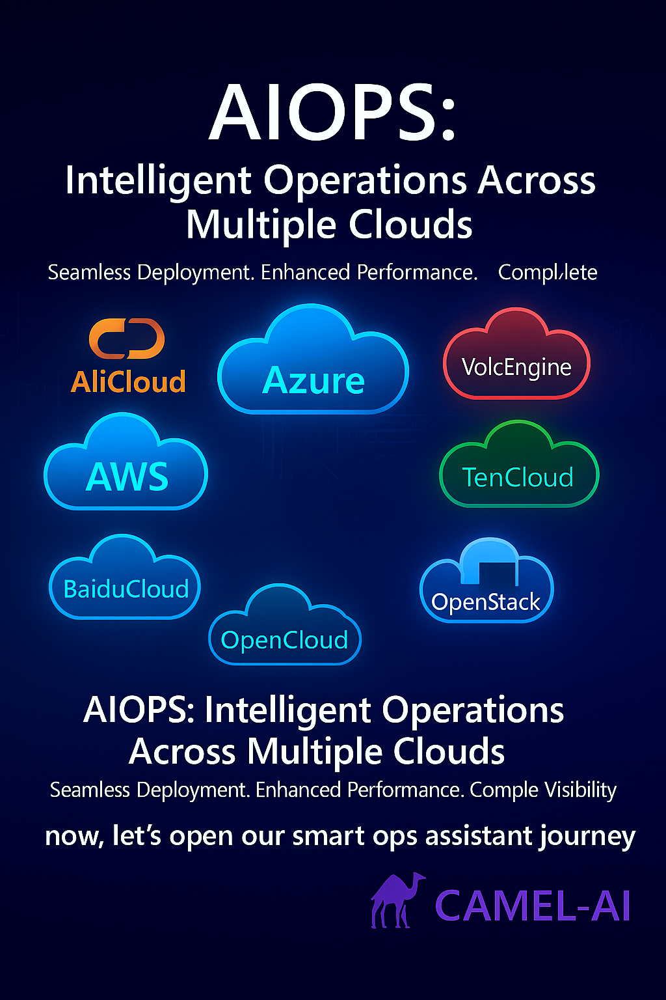

  

 

<h1> AIOPS: Next Generation Paradigm Of Multi cloud AI deployment and executable devops assistant
</h1>

[![Documentation][docs-image]][docs-url]
[![Discord][discord-image]][discord-url]
[![X][x-image]][x-url]
[![Reddit][reddit-image]][reddit-url]
[![Wechat][wechat-image]][wechat-url]
[![Wechat][oasis-image]][oasis-url]
[![Hugging Face][huggingface-image]][huggingface-url]
[![Star][star-image]][star-url]
[![Package License][package-license-image]][package-license-url]

<h4 align="center">

[Community](https://github.com/camel-ai/camel#community) |
[Paper]() |
[Examples]() |
[Dataset]() |
[Citation]() |
[Contributing]() |
[CAMEL-AI](https://www.camel-ai.org/)

</h4>

 

## ✨ Key Features

### 📈 query your any cloud resource as chat

aiops supports query any clouds resource and summaryany as ***chat*** and it could auto write the many kinds of policy (like iam policy , object bucket policy) and auto instead of you.

### 📲 deploy as chat 

aiops supports deploy any clouds any resource as ***chat***

### 👍🏼 deploy from template with Best practices

aiops supports deploy any clouds resource from ***template*** both from offical suggestion and create by yourself

### 🔥 deploy from nlp and auto 

aiops supports deploy and clouds resource from nlp , its help you to design clouds Topology and  terraform scripts auto, and execute deployment，and it supports Automatic repair and self-healing deployment with your deploying.

### 🔥 deploy from picture or manuscript as attachment

aiops supports deploy and clouds resource from attachement(both picture or manuscript) , its help you to design clouds Topology and  terraform scripts auto, and execute deployment

### 🔥 deploy history query and give the Topology and main.tf auto

aiops supports query all history deployments and give the Topology and main.tf auto,you can download as your wish

 

## 📺 Demo Video

### Introducing OASIS: Open Agent Social Interaction Simulations with One Million Agents

https://github.com/user-attachments/assets/3bd2553c-d25d-4d8c-a739-1af51354b15a

 

## 🖺 License

The source code is licensed under Apache 2.0.

[discord-image]: https://img.shields.io/discord/1082486657678311454?logo=discord&labelColor=%20%235462eb&logoColor=%20%23f5f5f5&color=%20%235462eb
[discord-url]: https://discord.camel-ai.org/
[docs-image]: https://img.shields.io/badge/Documentation-EB3ECC
[docs-url]: https://docs.oasis.camel-ai.org/
[huggingface-image]: https://img.shields.io/badge/%F0%9F%A4%97%20Hugging%20Face-CAMEL--AI-ffc107?color=ffc107&logoColor=white
[huggingface-url]: https://huggingface.co/camel-ai
[oasis-image]: https://img.shields.io/badge/WeChat-OASISProject-brightgreen?logo=wechat&logoColor=white
[oasis-url]: ./assets/wechatgroup.png
[package-license-image]: https://img.shields.io/badge/License-Apache_2.0-blue.svg
[package-license-url]: https://github.com/camel-ai/oasis/blob/main/licenses/LICENSE
[reddit-image]: https://img.shields.io/reddit/subreddit-subscribers/CamelAI?style=plastic&logo=reddit&label=r%2FCAMEL&labelColor=white
[reddit-url]: https://www.reddit.com/r/CamelAI/
[star-image]: https://img.shields.io/github/stars/camel-ai/oasis?label=stars&logo=github&color=brightgreen
[star-url]: https://github.com/camel-ai/oasis/stargazers
[wechat-image]: https://img.shields.io/badge/WeChat-CamelAIOrg-brightgreen?logo=wechat&logoColor=white
[wechat-url]: ./assets/wechat.JPGwechat.jpg
[x-image]: https://img.shields.io/twitter/follow/CamelAIOrg?style=social
[x-url]: https://x.com/CamelAIOrg
