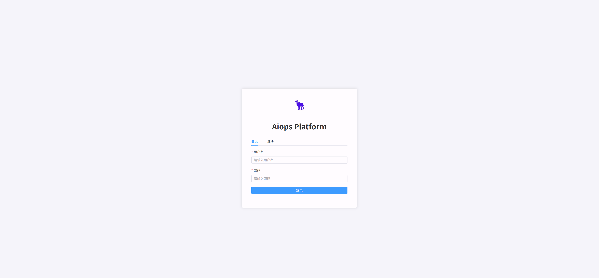
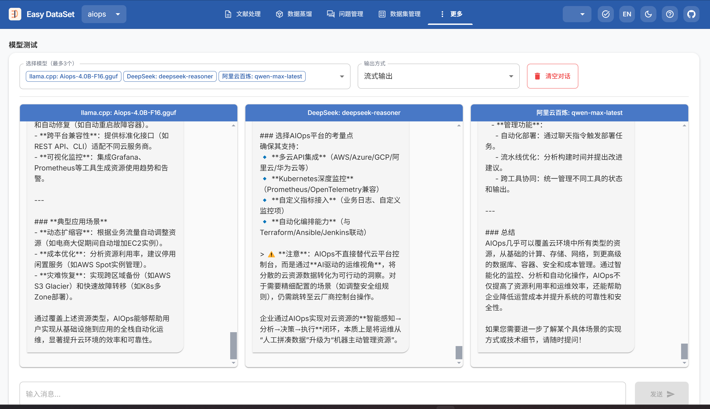

  

 

<h1> AIOPS: Next Generation Paradigm Of Multi cloud AI deployment and executable devops assistant
</h1>

[![Documentation][docs-image]][docs-url]
[![Discord][discord-image]][discord-url]
[![X][x-image]][x-url]
[![Reddit][reddit-image]][reddit-url]
[![Wechat][wechat-image]][wechat-url]
[![Wechat][oasis-image]][oasis-url]
[![Hugging Face][huggingface-image]][huggingface-url]
[![Star][star-image]][star-url]
[![Package License][package-license-image]][package-license-url]

<h4 align="center">

[Community](https://github.com/camel-ai/camel#community) |
[Paper]() |
[Examples]() |
[Dataset]() |
[Citation]() |
[Contributing]() |
[CAMEL-AI](https://www.camel-ai.org/)

</h4>

 

## ✨ what's aiops?

Simply put, it's about empowering multi-cloud deployment and operations with AI intelligence! 
・You can query and deploy cloud resources (AWS, Alibaba Cloud, Tencent Cloud, Azure, etc., all covered!) by talking to a chatbot. 
・You state your requirements, and AI automatically helps you design cloud architecture and generate deployment scripts (Terraform code so easy!). 
・Even, you provide a hand-drawn architecture diagram or document, and it can turn it into reality! 
・Deployment issues? AIOps can also intelligently repair and self-heal! 
・Deep integration with the Terraform MCP server 
・ai auto IAC coding recall rate exceeds 90% 
・gptDiagram all your envisioned cloud architectures. 
Sounds futuristic, doesn't it? AIOps project is dedicated to building the next-generation multi-cloud AI deployment and executable DevOps assistant! 

## ⚙️ Quick Start

**local deployment:**

Prerequisites

CPU >= 2 cores

RAM >= 4 GB

Disk >= 40 GB

Docker >= 24.0.0 & Docker Compose >= v2.26.1

1. git clone https://github.com/camel-ai/aiops.git
   
2. cd aiops
   
   cp env.example .env
   
   vi .env
    
   DEEPSEEK_API_KEY=your-deepseek-api-key

   #openai config
   
   OPENAI_API_KEY=your-openai-api-key
   
   OPENAI_API_BASE_URL=your-openai-base-url
   
   OPENAI_API_MODEL=gpt-4o

   #anthropic config
   
   ANTHROPIC_API_KEY=your-claude-api-key
   
   ANTHROPIC_API_BASE_URL=your-claude-base-url
   
   ANTHROPIC_API_MODEL=claude-sonnet-4-20250514

   #ai deploy model provider select(openai or claude)
  
   AI_MODEL_PROVIDER=openai
   
 3. chmod 777 deploy.sh
    
 4. ./deploy.sh

 

  
 

    
 6. access http://your-public-ip:80 
 

**cloud test:**

http://aiops.cloudet.cn/

## ✨ Key Features

### 📈 query your any cloud resource as chat

aiops supports query any clouds resource and summaryany as ***chat*** and it could auto write the many kinds of policy (like iam policy , object bucket policy) and auto instead of you.

### 📲 deploy and query as chat 

aiops supports query and deploy any clouds any resource in your cloud account as ***chat*** 

### 👍🏼 deploy from template with Best practices

aiops supports deploy any clouds resource from ***template*** both from offical suggestion and create by yourself

### 🔥 deploy from nlp and auto 

aiops supports deploy and clouds resource from nlp , its help you to design clouds Topology and  terraform scripts auto, and execute deployment，and it supports Automatic repair and self-healing deployment with your deploying.

### 🔥 deploy from picture or manuscript as attachment

aiops supports deploy and clouds resource from attachement(both picture or manuscript) , its help you to design clouds Topology and  terraform scripts auto, and execute deployment

### 🔥 deploy history query and give the Topology and main.tf auto

aiops supports query all history deployments and give the Topology and main.tf auto,you can download as your wish

 

## 📺 Demo Video

### Introducing AIOPS: how to build your cloud infrastuction from nlp and aiops platform with self health and auto fix function?

https://github.com/user-attachments/assets/0a63e9af-267e-4dcf-b6d2-9b01a3b6e42e

https://github.com/user-attachments/assets/b4960d70-e2f2-4347-a7cc-4b346ab9cdcf

https://github.com/user-attachments/assets/9a3f3919-05d9-4884-b199-313a0a8c523d

 

## ⚙️ aiops llm V1
aiops llm v1 is a text model for aiops&devops ,its have better answer thank deepseek-reasoner&qwen-max-latest only on aiops 

  

you  can download and deploy the aiops llm from hf
https://huggingface.co/yiminghub/aiops-qwen-4b

https://github.com/user-attachments/assets/b1c1ee17-5f95-403b-8ffb-56153b1c624e

https://github.com/user-attachments/assets/d55b6810-7114-49a3-8836-33ffe486364c

https://github.com/user-attachments/assets/179cc487-4e6b-470a-baa0-2d0d07203b07

## ⚙️ aiops datasets V1
aiops llm v1 is 1371 aiops q&a for aiops&devops ,its have first datasets on aiops&devops
you  can download and deploy the aiops dataset from hf
https://huggingface.co/datasets/yiminghub/aiops

## 📢 News

### Upcoming Features & Contributions
- AIOps Multi-Cloud AI Deployment Agent (or AIOps Multi-Cloud AI Deployment with Agent)
- AIOps Large Language Model (or AIOps LLM)
- AIOps Large Language Model Dataset Synthesis (or AIOps LLM Synthetic Dataset Generation)
- AIOps Assistant (or AI-powered Operations Assistant)
- AIOps and Cloud RAG Implementation (Solution, Scripts) (RAG stands for Retrieval Augmented Generation)
- AIOps Template Library Development (or AIOps Template Repository Construction)
- GitHub URL One-Click Deployment to Specific VM
- AIOps IaC Terraform MCP Server (IaC stands for Infrastructure as Code; MCP for Multi-Cloud Platform)
- Multi-Cloud AKSK, AI Site, LLM Site API Key Integration - Partnership Discussion (AKSK stands for Access Key Secret Key)
- Integration and Planning with Camel-Workforce Framework
- Support openstack deploy
- Support schedul all devops task oneday
- Support more resource for aws
- Support complete prompt for aws
- Support for invite code system for cloud demo
- Support human in loop when deploying
- Support for more model for general topo and terraform scripts
- Support for query about finance summary of aws
- Support muti cloud best practise templates auto
- Support share deployment and templates function
- Support more video and feishu summary all aiops work a day auto 

## 📢 roadmap

### Latest Updates

📢 Refactor into the AIOPS environment, publish camel-aiops on PyPI, and release the documentation. - 📆 April 24, 2025
- support ai deployment clouds as follow: - 📆 july 28, 2025
  aws
  aws(china)
  azure
  azure(china)
  aliyun
  volcengine
  tencentcloud
  baiducloud
  huaweicloud
- Support step by step ai guide for aiops (you can get knowhow about aiops just press index number of the questions - 📆 July 1, 2025
- Support flow output for chat - 📆 July 1, 2025
- Support memory for chat - 📆 July 1, 2025
- Support aws all region iaas resource full display just in one query both for nlp and caas model - 📆 July 1, 2025
- Support claude sonnet-4&opus-4 model for create topo and terraform config. - 📆 July 1, 2025
- Support AWS china deployment - 📆 March 4, 2025
- Support OPENAI gpt-4o model for create topo and terraform config. - 📆 March 25, 2025
- Support deepseek as chat assistant - 📆 March 24, 2025
- Support AWS china deployment - 📆 March 4, 2025
- Support AWS global deployment - 📆 January 13, 2025
- Support Volcengine china deployment - 📆 January 5, 2025
- Support key and project management - 📆 December 5, 2024
- Support for register - 📆 November 19, 2024
- Support Template deployment - 📆 November 19, 2024
- Support query for cloud resource and deploy vpc,subnet,iam user ,iam group,iam policy ,s3 for aws 

## 🥂 Contributing to AIOPS🏝️

> We greatly appreciate your interest in contributing to our open-source initiative. To ensure a smooth collaboration and the success of contributions, we adhere to a set of contributing guidelines similar to those established by CAMEL. For a comprehensive understanding of the steps involved in contributing to our project, please refer to the CAMEL [contributing guidelines](https://github.com/camel-ai/camel/blob/master/CONTRIBUTING.md). 🤝🚀
>
> An essential part of contributing involves not only submitting new features with accompanying tests (and, ideally, examples) but also ensuring that these contributions pass our automated pytest suite. This approach helps us maintain the project's quality and reliability by verifying compatibility and functionality.

## 📬 Community & Contact

If you're keen on exploring new research opportunities or discoveries with our platform and wish to dive deeper or suggest new features, we're here to talk. Feel free to get in touch for more details at camel.ai.team@gmail.com.

 

- Join us ([*Discord*](https://discord.camel-ai.org/) or [*WeChat*](https://ghli.org/camel/wechat.png)) in pushing the boundaries of finding the scaling laws of agents.

  

- Join Wechat for further discussions!(aiops wechat group)

  

- Join Wechatgroup for further discussions!(camel-wechat group)

> We welcome community contributions! Join us in building these exciting features.

## 🙌 Acknowledgment

We would like to thank Douglas for designing the logo of our project.

## 🖺 License

The source code is licensed under Apache 2.0.

[discord-image]: https://img.shields.io/discord/1082486657678311454?logo=discord&labelColor=%20%235462eb&logoColor=%20%23f5f5f5&color=%20%235462eb
[discord-url]: https://discord.camel-ai.org/
[docs-image]: https://img.shields.io/badge/Documentation-EB3ECC
[docs-url]: https://github.com/camel-ai/aiops/tree/main/docs
[huggingface-image]: https://img.shields.io/badge/%F0%9F%A4%97%20Hugging%20Face-CAMEL--AI-ffc107?color=ffc107&logoColor=white
[huggingface-url]: https://huggingface.co/camel-ai
[oasis-image]: https://img.shields.io/badge/WeChat-OASISProject-brightgreen?logo=wechat&logoColor=white
[oasis-url]: ./assets/wechatgroup.png
[package-license-image]: https://img.shields.io/badge/License-Apache_2.0-blue.svg
[package-license-url]: https://github.com/camel-ai/oasis/blob/main/licenses/LICENSE
[reddit-image]: https://img.shields.io/reddit/subreddit-subscribers/CamelAI?style=plastic&logo=reddit&label=r%2FCAMEL&labelColor=white
[reddit-url]: https://www.reddit.com/r/CamelAI/
[star-image]: https://img.shields.io/github/stars/camel-ai/oasis?label=stars&logo=github&color=brightgreen
[star-url]: https://github.com/camel-ai/oasis/stargazers
[wechat-image]: https://img.shields.io/badge/WeChat-CamelAIOrg-brightgreen?logo=wechat&logoColor=white
[wechat-url]: ./assets/wechat.JPGwechat.jpg
[x-image]: https://img.shields.io/twitter/follow/CamelAIOrg?style=social
[x-url]: https://x.com/CamelAIOrg
